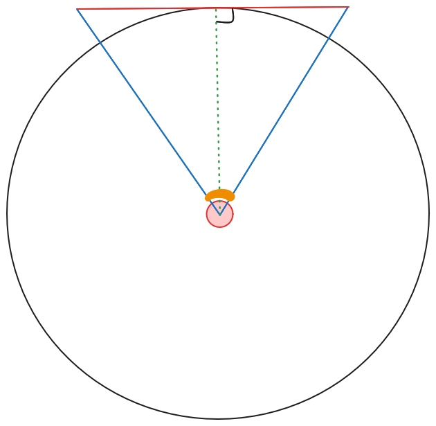
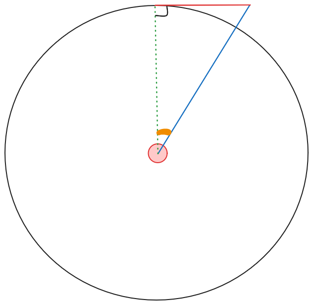
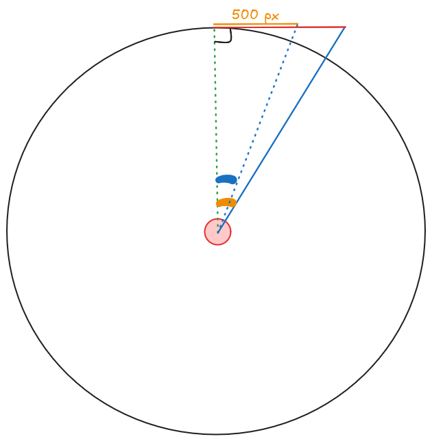

# Understanding sensitivity in 3D video games

A relatively short explanation about how mouse sensitivity works in 3D video games.

## Introduction

Have you ever wondered how to truly do a 1:1 sensitivity conversion? Or how to write an AI-based aimbot that doesn't edit the target process' memory? This formula explains it all:
$$\frac{arctan(\frac{x}{\frac{\frac{1}{2} \cdot width}{tan(\frac{1}{2} \cdot hfov)}})}{yaw \cdot sensitivity}$$
Let's try to understand it!

## The initial schema

Look carefully at the following image: understanding it is **crucial** to this guide.

- The red circle at the center of the black one represents the player, seen from above.
- The blue triangle represents the player's **horizontal field of view (FOV)**.
- The FOV itself is represented by the orange arc of circle.
- The red line represents the screen, in pixels. If the game is run in fullscreen mode, it might be 1920 pixels, or 2560, or something else.
- The dotted green line represents what the player is looking at, which is also the middle of the screen (red line).

In fact, we don't need to focus on the whole field of view: for our purposes, we will work with half of it:

Now, the orange arc of circle represents half of the player's FOV, and the red line represents half of the screen.

## The objective

What we want is a formula that will tell us **how many pixels we have to move our mouse if we want to go from the middle of the screen** (where the player is looking at) **to somewhere else on the screen**, for instance 500 pixels from the center:

The thing we are trying to calculate first is the angle in blue, which we will then use inside a simple formula to get back the number of pixels we need to move our mouse of.

In fact, the final (simplified) formula is:

$$\frac{blue\ angle}{yaw \cdot sensitivity}$$

- $yaw$ is a special value (in degrees per pixel) which tells how many degrees your camera will move if you move your mouse of one pixel. For instance, CS:GO's $yaw$ is $0.022$, so it means that if you move your mouse of one pixel, your view angle will be incremented/decremented by $0.022$ degrees.
- $sensitivity$ is your in-game sensitivity, the one you have control over. As we can see in the formula, it is just a unitless multiplier for the $yaw$.

Let's calculate the blue angle ! It involves a little bit of trigonometry, but don't worry, it will be fine.

## Calculating the blue angle

The blue angle can be calculated with the definition of the tangent:

$$tan(blue\ angle) = \frac{orange\ opposite\ side}{adjacent\ side}$$
where:

- $orange\ opposite\ side$ is the orange line (in our example, its value is 500)
- $adjacent\ side$ is the green dotted line.

Since
$$tan(blue\ angle) = \frac{orange\ opposite\ side}{adjacent\ side}$$
then
$$blue\ angle = arctan(\frac{orange\ opposite\ side}{adjacent\ side})$$

However, we do not yet know the length of the adjacent side, but we can calculate it using the definition of the tangent again:
$$tan(orange\ angle) = \frac{red\ opposite\ side}{adjacent\ side}$$
$$<=> adjacent\ side = \frac{red\ opposite\ side}{tan(orange\ angle)}$$

where:

- $opposite\ side$ is the red line, which is actually half of the screen's size. For instance, if the game is in fullscreen mode on a 1920x1080 resolution, then $opposite\ side = \frac{1920}{2} = 960$.
- $orange\ angle$ is actually half of the horizontal FOV. For instance, CS:GO's horizontal FOV is 106.26 degrees, so $orange\ angle = \frac{106.26}{2} = 53.13$.

Now, we can plug everything into a big, beautiful formula that will give a result in degrees:

$$blue\ angle = arctan(\frac{orange\ opposite\ side}{\frac{red\ opposite\ side}{tan(orange\ angle)}})$$

Plugging the values from our example (CS:GO):

- $orange\ opposite\ side = 500px$
- $red\ opposite\ side = \frac{1}{2} \cdot screen\ width = \frac{1}{2} \cdot 1920 = 960$
- $orange\ angle = \frac{1}{2} \cdot horizontal\ fov = \frac{1}{2} \cdot 106.26 = 53.13$

we get:
$$blue\ angle = arctan(\frac{500}{\frac{960}{tan(53.13)}})$$

Then, we divide this by $yaw\ (0.022) \cdot sensitivity$ (let's assume $sensitivity$ is $1.03$):
$$\frac{arctan(\frac{500}{\frac{960}{tan(53.13)}})}{0.022 \cdot 1.03} \approx 1537 $$

## Discussion

- This formula can explain why true 1:1 sensitivity conversion between different games is impossible (unless all the settings are the same, of course): because no solution exist for $\frac{arctan(all\ the\ stuff\ inside)}{yaw \cdot sensitivity} = \frac{arctan(all\ the\ stuff\ inside\ but\ for\ another\ game)}{yaw' \cdot sensitivity'}$.
- This formula also explains why the force required to go over twice a distance $d$ is not two times the force required to go over the same distance $d$: because again, the formula is not linear (try to plot it to see it for yourself !).
